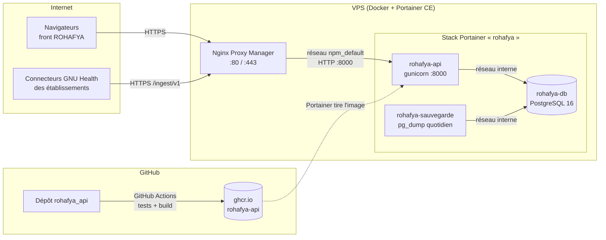

# Déploiement de l'API ROHAFYA sur un VPS (Docker + Portainer CE)

Ce document décrit la mise en production de l'API ROHAFYA (Flask) dans des conteneurs Docker,
sur un VPS administré avec **Portainer CE**, derrière **Nginx Proxy Manager**. L'image est
construite par **GitHub Actions** et publiée sur **GitHub Container Registry** (ghcr.io).

Toutes les procédures ci-dessous ont été exécutées sur une copie locale de la stack avant
rédaction (voir [§ 14](#14-validation-effectuée)).

## Sommaire

1. [Architecture](#1-architecture)
2. [Fichiers du dépôt](#2-fichiers-du-dépôt)
3. [Ce qui change par rapport à l'installation actuelle](#3-ce-qui-change-par-rapport-à-linstallation-actuelle)
4. [Prérequis](#4-prérequis)
5. [Étape 1 : publier l'image avec GitHub Actions](#5-étape-1--publier-limage-avec-github-actions)
6. [Étape 2 : préparer Portainer](#6-étape-2--préparer-portainer)
7. [Étape 3 : créer la stack](#7-étape-3--créer-la-stack)
8. [Étape 4 : initialiser ou migrer la base](#8-étape-4--initialiser-ou-migrer-la-base)
9. [Étape 5 : exposer l'API avec Nginx Proxy Manager](#9-étape-5--exposer-lapi-avec-nginx-proxy-manager)
10. [Étape 6 : raccorder le front et les connecteurs](#10-étape-6--raccorder-le-front-et-les-connecteurs)
11. [Exploitation](#11-exploitation)
12. [Sécurité](#12-sécurité)
13. [Dépannage](#13-dépannage)
14. [Validation effectuée](#14-validation-effectuée)
15. [Référence des variables d'environnement](#15-référence-des-variables-denvironnement)

---

## 1. Architecture



| Composant | Rôle | Exposition |
|---|---|---|
| `rohafya-api` | API Flask servie par gunicorn (3 processus × 2 fils par défaut) | Aucun port publié. Joignable seulement par Nginx Proxy Manager, sur son réseau Docker |
| `rohafya-db` | PostgreSQL 16, données sur le volume `rohafya_pgdata` | Aucun port publié. Réseau `interne` sans accès à Internet |
| `rohafya-sauvegarde` | `pg_dump` quotidien, rotation 7 jours / 4 semaines / 6 mois | Réseau `interne` uniquement |
| Nginx Proxy Manager | Terminaison HTTPS (Let's Encrypt), routage du domaine vers l'API | Ports 80 et 443 du VPS |

Flux de mise à jour : un `git push` sur `main` lance les tests, puis la construction de l'image
et sa publication sur ghcr.io. Dans Portainer, « Update the stack » avec re-téléchargement de
l'image applique la nouvelle version (voir [§ 11.1](#111-mettre-à-jour-lapplication)).

---

## 2. Fichiers du dépôt

| Fichier | Contenu |
|---|---|
| `Dockerfile` | Image Python 3.13 slim, utilisateur non root `rohafya` (uid 10001), healthcheck sur `/sante` |
| `.dockerignore` | Exclut du contexte de construction les secrets, l'environnement virtuel `envDoc`, les tests, le connecteur et la documentation |
| `docker/requirements.txt` | Dépendances réellement importées par l'API, versions validées par les tests |
| `docker/entrypoint.sh` | Attend PostgreSQL (60 s maximum), crée les tables manquantes une seule fois, puis lance gunicorn |
| `docker/gunicorn.conf.py` | Configuration de gunicorn : processus, délais, journaux sur la sortie standard |
| `deploy/portainer-stack.yml` | Stack à coller dans Portainer : API, base et sauvegardes |
| `deploy/stack.env.exemple` | Modèle des variables de la stack |
| `.github/workflows/image-docker.yml` | Tests, construction et publication de l'image |
| `Rohafya/tryton_absent.py` | Mode « sans GNU Health » de l'API |

Modifications du code de l'API faites pour le conteneur :

- **`Rohafya/env_prod.py` et `env_dev.py`** : plus aucun secret dans le code. Mots de passe et clés sont lus dans les variables d'environnement (`ROHAFYA_*`, [§ 15](#15-référence-des-variables-denvironnement)).
- **`Rohafya/__init__.py`** :
  - la lecture directe de GNU Health devient optionnelle (`ROHAFYA_GNUHEALTH`) ;
  - la configuration Tryton et le dossier des fichiers envoyés sont lus dans l'environnement ;
  - `ProxyFix` restitue l'IP et le schéma réels du client derrière le proxy ;
  - une route `GET /sante` sert de sonde ;
  - l'API s'arrête avec un message clair si un secret obligatoire manque.

Sans variable d'environnement particulière, le comportement est celui d'avant : GNU Health est
lu en direct. Une installation classique sur le serveur GNU Health continue donc de fonctionner,
à condition de fournir les secrets par l'environnement.

---

## 3. Ce qui change par rapport à l'installation actuelle

Aujourd'hui, l'API tourne **sur le serveur GNU Health** et lit Tryton en direct. Sur le VPS, il
n'y a pas de GNU Health : l'image démarre avec `ROHAFYA_GNUHEALTH=false`. Dans ce mode, toute
lecture Tryton renvoie une liste vide (`Rohafya/tryton_absent.py`), et les données des
établissements arrivent par l'API d'ingestion (connecteur GNU Health, API ROHAFYA, FHIR, PDF).

| Fonction | Sur le VPS |
|---|---|
| Comptes, connexion par code e-mail, rôles, permissions | ✅ Inchangé |
| Établissements, QR codes, rattachements, back-offices SaaS | ✅ Inchangé |
| Résultats et factures **reçus** des établissements (connecteur, API, FHIR, PDF) | ✅ Affichés |
| Résultats et factures de PDMD Santé lus **en direct** dans GNU Health | ⚠️ Listes vides, tant que PDMD Santé n'envoie pas ses données par le connecteur |
| Commissions des médecins, listes de prix (devis), import des médecins / patients depuis GNU Health | ⚠️ Listes vides (lecture directe Tryton) |
| `GET /gnu_doctor/test` (diagnostic Tryton) | ❌ Erreur 500, sans objet sans GNU Health |

> **Avant de faire pointer le domaine de production vers le VPS**, PDMD Santé doit envoyer ses
> données par le connecteur. Sinon, ses patients ne verront plus leurs résultats. D'ici là,
> déployer le VPS sur un domaine de préproduction (par exemple `api-preprod.rohafya.com`) : la
> procédure est identique.

---

## 4. Prérequis

**VPS**
- Linux 64 bits (x86_64 ; pour ARM, voir [§ 5.3](#53-architecture-du-vps)), avec Docker Engine 24 ou plus récent et le plugin Compose v2, déjà utilisé par Portainer.
- Ressources minimales : 2 vCPU, 2 Go de RAM (4 Go conseillés) et 20 Go de disque libre (images, base, sauvegardes).
- Portainer CE 2.19 ou plus récent, avec l'environnement Docker local.
- Nginx Proxy Manager déjà en service, ports 80 et 443 ouverts.
- Sortie vers Internet autorisée sur le port 587 (SMTP Office 365). Certains hébergeurs le bloquent par défaut.

**DNS**
- Un enregistrement `A` (et `AAAA` en IPv6) du domaine de l'API, par exemple `api.rohafya.com`, vers l'IP du VPS. Let's Encrypt doit pouvoir joindre le port 80 du VPS sous ce nom.

**GitHub**
- Accès en écriture au dépôt `ManuelZe/rohafya_api`.
- Un jeton d'accès personnel *classic* avec la seule permission `read:packages`, pour que Portainer télécharge l'image privée ([§ 6.1](#61-accès-à-limage-privée-ghcrio)).

**Sur le poste d'administration**
- `git`, et `openssl` pour générer les secrets.
- Pour une migration : un accès au serveur actuel et à `pg_dump`.

---

## 5. Étape 1 : publier l'image avec GitHub Actions

### 5.1 Vérifier qu'aucun secret ne part sur GitHub

Le workflow construit l'image à partir du dépôt : tout ce qui est commité y est visible.
Avant le premier push, vérifier :

```sh
git status --short                         # fichiers sur le point d'être ajoutés
git check-ignore -v cert.pem key.pem username_password.txt deploy/stack.env
grep -rnE "(PASSWORD|SECRET_KEY|SALT)\s*=\s*['\"][^'\"]{6,}" Rohafya/env_*.py   # doit ne rien afficher
```

Les fichiers `cert.pem`, `key.pem`, `username_password.txt`, `.env`, `deploy/stack.env`,
`envDoc/` et les fichiers `*.swp` sont ignorés par `.gitignore`. Mais **un `.gitignore` ne
s'applique pas aux fichiers déjà suivis par git**. Ceux qui ont été commités doivent être retirés
de l'index (les fichiers restent sur le disque) :

```sh
git rm --cached cert.pem key.pem username_password.txt Rohafya/.admin.py.swp Rohafya/blog/.blog.py.swp
git ls-files | grep -E "pem$|username_password|\.swp$"   # doit ne rien afficher
```

> **Secrets déjà publiés.** Le commit `581e6f9` (5 octobre 2026), poussé sur le dépôt
> **public** `ManuelZe/rohafya_api`, contient en clair :
> - les secrets de `Rohafya/env_prod.py` et `env_dev.py` ;
> - la clé privée `key.pem` ;
> - `username_password.txt`.
>
> Retirer les fichiers dans un nouveau commit ne les efface pas de l'historique. Il faut
> considérer ces secrets comme compromis, et les **changer partout où ils servent** : boîte mail,
> PostgreSQL du serveur actuel, clés Flask et JWT de l'API en production, certificat TLS, mots de
> passe des comptes listés. Sur le VPS, utiliser des clés **nouvelles**
> ([§ 7.2](#72-générer-les-secrets)), jamais les anciennes.

### 5.2 Pousser le code

```sh
git add .
git commit -m "Conteneurisation de l'API (Docker, Portainer, GitHub Actions)"
git push origin main
```

Dans GitHub → **Actions** → « Image Docker de l'API », deux tâches s'enchaînent :

1. **Tests** : `Rohafya/tests/test_saas.py` (99 vérifications) et `connecteur_gnuhealth/tests/test_connecteur.py` (39 vérifications). L'image n'est pas construite si un test échoue.
2. **Image** : construction de l'image, puis publication sur `ghcr.io/manuelze/rohafya-api` avec les étiquettes `latest` et `sha-<commit>`.

Le paquet apparaît dans GitHub → profil → **Packages** → `rohafya-api`, **privé** par défaut
et relié au dépôt.

### 5.3 Architecture du VPS

L'image est construite pour `linux/amd64`. Pour un VPS ARM (Ampere, Graviton…), remplacer dans
`.github/workflows/image-docker.yml` :

```yaml
platforms: linux/amd64,linux/arm64
```

Commande pour connaître l'architecture du VPS : `uname -m` (`x86_64` = amd64, `aarch64` = arm64).

### 5.4 Versions

| Étiquette | Produite par | Usage |
|---|---|---|
| `latest` | chaque push sur `main` | préproduction |
| `sha-1a2b3c4` | chaque push | retour arrière précis |
| `1.0.0`, `1.0` | un tag git `v1.0.0` | **production** (version figée) |

Publier une version :
```sh
git tag v1.0.0 && git push origin v1.0.0
```

---

## 6. Étape 2 : préparer Portainer

### 6.1 Accès à l'image privée ghcr.io

1. Sur GitHub : **Settings** → **Developer settings** → **Personal access tokens** → **Tokens (classic)** → **Generate new token**. Cocher seulement `read:packages`, et choisir une expiration (90 jours, à renouveler).
2. Dans Portainer : **Registries** → **Add registry** → **Custom registry** :
   - **Name** : `ghcr`
   - **Registry URL** : `ghcr.io`
   - **Authentication** : activé. **Username** : le compte GitHub, **Password** : le jeton.
3. **Add registry**.

Portainer utilise automatiquement ces identifiants pour toute image `ghcr.io/...`.

### 6.2 Repérer le réseau de Nginx Proxy Manager

L'API ne publie aucun port : Nginx Proxy Manager la joint par son nom de conteneur, sur un
réseau Docker commun. Il faut connaître le nom de ce réseau.

**Avec Portainer** : **Containers** → conteneur de Nginx Proxy Manager → section
**Connected networks**. Le nom affiché ressemble à `npm_default` ou à
`nginx-proxy-manager_default`.

**En SSH** :
```sh
docker ps --format '{{.Names}}\t{{.Image}}' | grep -i nginx-proxy-manager
docker inspect <nom_du_conteneur_npm> --format '{{range $n, $_ := .NetworkSettings.Networks}}{{$n}}{{"\n"}}{{end}}'
```

Ce nom sera la valeur de `NPM_NETWORK` ([§ 7.3](#73-variables-de-la-stack)).

> Si Nginx Proxy Manager n'est que sur le réseau `bridge` par défaut, créer un réseau dédié et
> l'y connecter : `docker network create proxy && docker network connect proxy <conteneur_npm>`,
> puis utiliser `NPM_NETWORK=proxy`.

---

## 7. Étape 3 : créer la stack

### 7.1 Coller la stack

Portainer → **Stacks** → **Add stack** :

- **Name** : `rohafya`. Ce nom préfixe les volumes : `rohafya_pgdata`, `rohafya_fichiers` et `rohafya_sauvegardes`.
- **Build method** : **Web editor**.
- Coller le contenu de [`deploy/portainer-stack.yml`](../deploy/portainer-stack.yml).

### 7.2 Générer les secrets

Sur n'importe quel poste avec `openssl` :

```sh
for nom in POSTGRES_PASSWORD ROHAFYA_SECRET_KEY ROHAFYA_JWT_SECRET_KEY ROHAFYA_PASSWORD_SALT; do
  echo "$nom=$(openssl rand -hex 32)"
done
```

- **Format** : générer les secrets en hexadécimal, sans caractères spéciaux. `POSTGRES_PASSWORD` entre dans une URL de connexion, et un `$` serait interprété par Compose.
- **Conservation** : ranger les valeurs dans un gestionnaire de mots de passe. Perdre `POSTGRES_PASSWORD` complique l'accès aux sauvegardes.
- **Impact** : changer ces clés plus tard déconnecte seulement les sessions en cours (les jetons JWT). Les mots de passe des utilisateurs ne dépendent pas de ces clés.

### 7.3 Variables de la stack

Toujours dans l'écran de création : **Environment variables** → **Advanced mode**. Coller le
contenu de [`deploy/stack.env.exemple`](../deploy/stack.env.exemple), puis compléter :

| Variable | Valeur |
|---|---|
| `POSTGRES_PASSWORD`, `ROHAFYA_SECRET_KEY`, `ROHAFYA_JWT_SECRET_KEY`, `ROHAFYA_PASSWORD_SALT` | secrets générés au [§ 7.2](#72-générer-les-secrets) |
| `ROHAFYA_MAIL_PASSWORD` | mot de passe de `eden.no-reply@pdmdsante.com` |
| `NPM_NETWORK` | nom relevé au [§ 6.2](#62-repérer-le-réseau-de-nginx-proxy-manager) |
| `ROHAFYA_VERSION` | `latest` en préproduction, une version figée (`1.0.0`) en production |
| `ROHAFYA_FRONT_URL`, `ROHAFYA_FRONT_ORIGINS` | adresses du front ([§ 10.1](#101-front-end)) |

Une variable obligatoire vide bloque le déploiement avec un message explicite, par exemple
`required variable ROHAFYA_JWT_SECRET_KEY is missing a value`.

### 7.4 Déployer

**Deploy the stack**. Portainer télécharge les images et démarre les conteneurs dans cet ordre :

1. `rohafya-db`, jusqu'à l'état *healthy* (environ 10 s) ;
2. `rohafya-api` et `rohafya-sauvegarde`.

Vérifier dans **Containers** que `rohafya-api` passe à **healthy**, en 30 à 60 s. Ses journaux
(**Logs**) doivent montrer :

```
Base de données disponible.
GNU Health désactivé (ROHAFYA_GNUHEALTH=false) : aucune donnée n'est lue en direct dans Tryton.
Tables vérifiées.
[INFO] Starting gunicorn 23.0.0
[INFO] Listening at: http://0.0.0.0:8000 (1)
[INFO] Booting worker with pid: …   (× 3)
```

La ligne « GNU Health désactivé » apparaît une fois par processus : c'est normal.

---

## 8. Étape 4 : initialiser ou migrer la base

Les commandes se lancent soit dans Portainer, soit en SSH :

- **Portainer** : **Containers** → `rohafya-api` → **Console** → *Command* `/bin/sh`, *User* `rohafya` → **Connect**.
- **SSH** : préfixer chaque commande par `docker exec rohafya-api` (ou `docker exec rohafya-db` pour la base).

### 8.A Nouvelle installation (base vide)

```sh
flask saas init
flask saas create-superadmin admin@pdmdsante.com --first-name Prénom --last-name Nom
```

`flask saas init` est idempotent, on peut le relancer sans risque. Il :
- crée les rôles SaaS et les 212 permissions du catalogue (`Rohafya/permissions/permissions.py`) ;
- **ajoute aux rôles Patient et Doctor les permissions `patients.*` et `doctors.*` qui leur manquent** ;
- crée l'établissement GNU Health historique.

Sans ces permissions par défaut, un compte patient ou médecin reçoit `403 {"error":"Permission
denied"}` sur toutes ses requêtes. La commande ne retire jamais de permission. En revanche, une
permission de la famille retirée à la main est rajoutée : pour l'éviter, utiliser
`flask saas init --sans-permissions`.

Le super-administrateur se connecte ensuite avec « Code par e-mail » sur le front.

Un message `(trapped) error reading bcrypt version … AttributeError: module 'bcrypt' has no
attribute '__about__'` peut s'afficher : il est bénin (incompatibilité d'affichage entre
`passlib` et `bcrypt`), la commande aboutit.

### 8.B Migration de la base actuelle `gnu_doctor2`

Prévoir une **fenêtre de maintenance** : entre la sauvegarde et la bascule, aucune écriture
ne doit avoir lieu sur l'ancienne API (inscriptions, envois de résultats…).

**1. Sur le serveur actuel**, sauvegarder au format personnalisé de PostgreSQL :

```sh
pg_dump -h localhost -U gnuhealth -d gnu_doctor2 -Fc -f gnu_doctor2.dump
psql -h localhost -U gnuhealth -d gnu_doctor2 -tAc "select count(*) from users; select count(*) from patients; select count(*) from doctors;"
scp gnu_doctor2.dump <utilisateur>@<vps>:/tmp/
```

Noter les trois nombres affichés : ils serviront au contrôle final.

**2. Sur le VPS**, restaurer dans un schéma vidé :

```sh
docker stop rohafya-api
docker cp /tmp/gnu_doctor2.dump rohafya-db:/tmp/gnu_doctor2.dump
docker exec rohafya-db psql -U rohafya -d rohafya -v ON_ERROR_STOP=1 \
  -c "DROP SCHEMA public CASCADE; CREATE SCHEMA public;"
docker exec rohafya-db pg_restore -U rohafya -d rohafya \
  --no-owner --no-privileges --single-transaction /tmp/gnu_doctor2.dump
docker exec rohafya-db rm /tmp/gnu_doctor2.dump && rm /tmp/gnu_doctor2.dump
docker start rohafya-api
```

**3. Compléter et contrôler** :

```sh
docker exec rohafya-api flask saas init
docker exec rohafya-db psql -U rohafya -d rohafya -tAc \
  "select count(*) from users; select count(*) from patients; select count(*) from doctors;"
```

Les trois nombres doivent être identiques à ceux de l'étape 1.

Détail des options :

- **Le schéma doit être vidé**, et non simplement restauré avec `pg_restore --clean`. Au premier démarrage, l'API a créé des tables vides, dont les tables `saas_*`. Si l'ancienne base ne les contient pas, `--clean` échoue : il ne peut pas supprimer `users`, encore référencée par ces tables. Cet échec a été reproduit lors des tests.
- **`--no-owner --no-privileges`** : dans l'ancienne base, les objets appartiennent à `gnuhealth`. Ils sont recréés au nom de `rohafya`.
- **`--single-transaction`** : en cas d'erreur, rien n'est appliqué, et on peut recommencer.
- **Tables manquantes** : au redémarrage, l'API crée celles que l'ancienne base n'avait pas (les tables `saas_*`).
- **Version de PostgreSQL** : un fichier produit par un PostgreSQL plus ancien (12, 13, 14…) se restaure sans problème dans PostgreSQL 16.

---

## 9. Étape 5 : exposer l'API avec Nginx Proxy Manager

Nginx Proxy Manager → **Hosts** → **Proxy Hosts** → **Add Proxy Host**.

**Onglet Details**

| Champ | Valeur |
|---|---|
| Domain Names | `api.rohafya.com` (ou le domaine de préproduction) |
| Scheme | `http` |
| Forward Hostname / IP | `rohafya-api`, le nom du conteneur (préfixe `ROHAFYA_NOM`) |
| Forward Port | `8000` |
| Cache Assets | désactivé |
| Block Common Exploits | activé |
| Websockets Support | désactivé (non utilisé) |

**Onglet SSL**

| Champ | Valeur |
|---|---|
| SSL Certificate | *Request a new SSL Certificate* (Let's Encrypt) |
| Force SSL | activé |
| HTTP/2 Support | activé |
| HSTS Enabled | activé, une fois le HTTPS vérifié |
| Email / Agree to ToS | e-mail de l'administrateur, accepté |

**Onglet Advanced** (*Custom Nginx Configuration*) :

```nginx
# Comptes rendus PDF et envois du connecteur : l'API accepte jusqu'à 16 Mo.
client_max_body_size 20m;
# gunicorn coupe une requête après 120 s : le proxy attend un peu plus.
proxy_read_timeout 130s;
proxy_send_timeout 130s;
```

**Vérification**, depuis n'importe quel poste :

```sh
curl -s https://api.rohafya.com/sante
# {"base":"ok","gnuhealth":"desactive","statut":"ok"}
```

Une réponse **502 Bad Gateway** signifie que Nginx Proxy Manager ne joint pas le conteneur :
le réseau `NPM_NETWORK` ou le nom du conteneur ne correspond pas
([§ 13](#13-dépannage)).

---

## 10. Étape 6 : raccorder le front et les connecteurs

### 10.1 Front-end

- Dans la configuration du front (Angular), l'URL de l'API devient `https://api.rohafya.com`. Reconstruire et redéployer le front.
- `ROHAFYA_FRONT_ORIGINS` : liste les origines du front autorisées à appeler l'API (CORS), séparées par des virgules, sans `/` final. Exemple : `https://rohafya.com,https://preprod.rohafya.com`.
- `ROHAFYA_FRONT_URL` : adresse imprimée dans les QR codes et les e-mails.

### 10.2 Connecteurs GNU Health

Pour chaque établissement équipé du connecteur (`connecteur_gnuhealth/README.md`) :

1. Dans ROHAFYA, en super-administrateur, créer l'établissement avec le type **« API »**, puis copier sa clé.
2. Dans `/etc/rohafya/connecteur.ini` sur le serveur GNU Health : `url = https://api.rohafya.com` et `cle_api = …`.
3. Lancer `verifier`, puis `synchro --essai`, puis `synchro`.

Les envois du connecteur (`/ingest/v1/*`) passent par Nginx Proxy Manager comme le reste ; la
limite de 20 Mo du [§ 9](#9-étape-5--exposer-lapi-avec-nginx-proxy-manager) couvre les lots
de 100 éléments.

---

## 11. Exploitation

### 11.1 Mettre à jour l'application

1. Pousser sur `main`. Pour la production, créer en plus un tag `vX.Y.Z` ([§ 5.4](#54-versions)).
2. Attendre la fin du workflow GitHub Actions, en vert.
3. Portainer → **Stacks** → `rohafya` → **Editor**.
   - En production : remplacer `ROHAFYA_VERSION` par la nouvelle version.
   - Avec `latest` : rien à modifier.
4. **Update the stack**, en activant l'option de re-téléchargement de l'image (« Re-pull image and redeploy » ou « Pull latest image » selon la version de Portainer).

Seul le conteneur `rohafya-api` est recréé : la base et les volumes sont conservés. Pendant le
redémarrage, l'API est indisponible quelques secondes.

**Retour arrière** : remettre l'ancienne valeur de `ROHAFYA_VERSION` (ou une étiquette
`sha-…`), puis **Update the stack**. Une version qui a ajouté des tables ou colonnes les
laisse en place ; l'ancienne version les ignore.

### 11.2 Journaux

- **Portainer** : **Containers** → `rohafya-api` → **Logs**. On y trouve les accès (IP du client, requête, statut, durée) et les erreurs de l'application.
- **SSH** : `docker logs -f --tail 200 rohafya-api`.
- **Rotation** : 5 fichiers de 10 Mo pour l'API, 3 × 10 Mo pour la base (option `logging` de la stack).

### 11.3 Commandes d'administration

| Besoin | Commande (console du conteneur `rohafya-api`) |
|---|---|
| Créer ou promouvoir un super-administrateur | `flask saas create-superadmin email@domaine --first-name … --last-name …` |
| Rôles, permissions (nouvelles et par défaut des rôles Patient / Doctor), établissement GNU Health (idempotent) | `flask saas init` |
| Idem, sans toucher aux permissions des rôles | `flask saas init --sans-permissions` |
| Shell PostgreSQL | `docker exec -it rohafya-db psql -U rohafya -d rohafya` (SSH) |

### 11.4 Sauvegardes

**Contenu** : le conteneur `rohafya-sauvegarde` lance chaque jour un `pg_dump` au format
personnalisé, compressé, dans le volume `rohafya_sauvegardes`.

| Dossier | Conservation |
|---|---|
| `daily/` | 7 jours |
| `weekly/` | 4 semaines |
| `monthly/` | 6 mois |
| `last/` | dernière sauvegarde (`rohafya-latest.dump`) |

**Sauvegarde immédiate**, par exemple avant une mise à jour importante :
```sh
docker exec rohafya-sauvegarde /backup.sh
```

**Lister les sauvegardes** :
```sh
docker exec rohafya-sauvegarde ls -lR /backups/last /backups/daily
```

**Copie hors du VPS (indispensable)** : une sauvegarde qui reste sur le même disque ne protège
ni d'une panne du VPS, ni d'une erreur chez l'hébergeur. Exemple de tâche cron sur le VPS, qui
copie chaque nuit la dernière sauvegarde et les fichiers envoyés vers un autre serveur :
```sh
# crontab -e (root)
30 3 * * * docker cp -L rohafya-sauvegarde:/backups/last/rohafya-latest.dump /root/rohafya-$(date +\%F).dump && scp -q /root/rohafya-$(date +\%F).dump sauvegarde@autre-serveur:/sauvegardes/rohafya/ && rm /root/rohafya-$(date +\%F).dump
45 3 * * * docker run --rm -v rohafya_fichiers:/f:ro -v /root:/out alpine tar czf /out/fichiers.tgz -C /f . && scp -q /root/fichiers.tgz sauvegarde@autre-serveur:/sauvegardes/rohafya/ && rm /root/fichiers.tgz
```

**Restauration** (procédure testée) :
```sh
docker cp -L rohafya-sauvegarde:/backups/last/rohafya-latest.dump /tmp/restauration.dump
docker stop rohafya-api
docker cp /tmp/restauration.dump rohafya-db:/tmp/restauration.dump
docker exec rohafya-db pg_restore -U rohafya -d rohafya \
  --clean --if-exists --no-owner --no-privileges --single-transaction /tmp/restauration.dump
docker exec rohafya-db rm /tmp/restauration.dump
docker start rohafya-api
```

Pour une sauvegarde de la stack elle-même, `--clean` suffit : toutes les tables y figurent.
Pour une base d'une autre origine, suivre le [§ 8.B](#8b-migration-de-la-base-actuelle-gnu_doctor2).

**Tester la restauration** une fois par trimestre, sur une stack de préproduction.

### 11.5 Surveillance

- **`GET /sante`** : répond `200` quand l'API et la base répondent, `503` quand la base est injoignable. Cette route n'écrit rien dans le journal d'activité.
- **Healthcheck Docker** : il interroge `/sante` toutes les 30 s ; après 3 échecs, Portainer affiche *unhealthy*. Docker ne redémarre pas seul un conteneur *unhealthy* : la politique `restart: unless-stopped` couvre seulement l'arrêt du processus.
- **Supervision externe** (conseillée) : un moniteur HTTP (Uptime Kuma, UptimeRobot…) sur `https://api.rohafya.com/sante`, toutes les minutes, avec une alerte e-mail.

### 11.6 Ressources

| Paramètre | Défaut | Ajustement |
|---|---|---|
| `GUNICORN_WORKERS` | 3 | ≈ 2 × nombre de vCPU + 1. Chaque processus occupe environ 120 à 150 Mo |
| `API_MEMOIRE_MAX` | `1g` | à relever si l'on augmente le nombre de processus |
| Délai gunicorn | 120 s | `GUNICORN_TIMEOUT`, à garder sous `proxy_read_timeout` |

### 11.7 Changer un secret

1. Portainer → **Stacks** → `rohafya` → **Editor** → modifier la variable → **Update the stack**.
2. Selon le secret :
   - `ROHAFYA_JWT_SECRET_KEY` : tous les utilisateurs devront se reconnecter.
   - `POSTGRES_PASSWORD` : la variable ne s'applique qu'à la **création** de la base. Pour une base existante, changer d'abord le mot de passe dans PostgreSQL, puis mettre à jour la stack :
     ```sh
     docker exec -it rohafya-db psql -U rohafya -d rohafya -c "ALTER USER rohafya PASSWORD '<nouveau>';"
     ```

---

## 12. Sécurité

### 12.1 Mesures en place

- **Base de données** isolée : réseau `internal`, sans port publié et sans accès à Internet.
- **API** : aucun port publié sur le VPS. Elle n'est joignable que par Nginx Proxy Manager, en HTTPS, ce qui évite aussi le contournement du pare-feu UFW par Docker, qui ne concerne que les ports publiés.
- **Conteneur** : l'API tourne sous un utilisateur non root (`rohafya`, uid 10001).
- **Secrets** : fournis par l'environnement de la stack, absents du code et de l'image.
- **Image** : construite par la CI à partir du dépôt, privée sur ghcr.io. L'accès en lecture passe par un jeton limité à `read:packages`.

### 12.2 Recommandations pour le VPS

- **Pare-feu** : n'ouvrir que 22 (SSH), 80 et 443. Restreindre l'interface de Portainer (9443) à des IP connues, ou la publier derrière Nginx Proxy Manager avec une liste d'accès :
  ```sh
  ufw default deny incoming && ufw allow 22/tcp && ufw allow 80/tcp && ufw allow 443/tcp && ufw enable
  ```
- **SSH** : connexion par clé uniquement (`PasswordAuthentication no`).
- **Mises à jour** : appliquer les mises à jour de sécurité du système (`unattended-upgrades`), et reconstruire l'image régulièrement pour profiter de celles de Python et Debian. Un push suffit.

### 12.3 Points à corriger dans le code

Ces points existaient avant la conteneurisation, mais ils deviennent importants une fois l'API
exposée sur Internet. Ils ont été constatés lors des tests.

| Point | Constat | Correction proposée |
|---|---|---|
| **CORS trop permissif** | Les 179 décorateurs `@cross_origin(supports_credentials=True)` acceptent n'importe quelle origine, avec `Access-Control-Allow-Credentials: true`. Ils passent par-dessus `ROHAFYA_FRONT_ORIGINS`. Test : une requête depuis `https://pirate.example` a été acceptée. | Ajouter `app.config['CORS_ORIGINS'] = front_origins()` dans `create_app()`. Flask-CORS applique alors cette liste à tous les décorateurs qui ne précisent pas d'origines, sans toucher aux 179 routes. |
| **Géolocalisation à chaque requête** | `log_user_activity` interroge `ip-api.com` de façon synchrone pour chaque requête, ce qui ajoute 0,5 à 2 s mesurées. Le service gratuit est limité à 45 requêtes/min, sans HTTPS. | Mettre en cache le résultat par IP (par exemple 24 h), ou géolocaliser en tâche de fond. |
| **`/routes` publique** | Elle liste toutes les routes de l'API sans authentification. | La protéger (`@jwt_required` + super-administrateur), ou la supprimer en production. |
| **`username_password.txt`** | `doctors/charge_doctors.py` écrit les identifiants générés **en clair** dans ce fichier. Dans le conteneur, l'écriture échoue : `/app` n'est pas modifiable par l'utilisateur `rohafya`. | Ne plus écrire les mots de passe. Les comptes se connectent désormais par code e-mail. |
| `import jsonify` | `deco/decorators.py` importe le paquet PyPI `jsonify`, inutile, d'où sa présence dans `docker/requirements.txt`. | Retirer l'import, puis la dépendance. |

---

## 13. Dépannage

| Symptôme | Cause probable | Solution |
|---|---|---|
| Le déploiement échoue avec `required variable … is missing a value` | Variable obligatoire vide dans la stack | Compléter la variable ([§ 7.3](#73-variables-de-la-stack)) |
| Échec du téléchargement de l'image : `denied` / `unauthorized` | Registre ghcr.io absent de Portainer, ou jeton expiré | Vérifier **Registries** et le jeton `read:packages` ([§ 6.1](#61-accès-à-limage-privée-ghcrio)) |
| Échec du téléchargement de l'image : `manifest unknown` | Étiquette `ROHAFYA_VERSION` inexistante, ou workflow encore en cours | Vérifier les étiquettes publiées dans GitHub → Packages |
| `network npm_default declared as external, but could not be found` | Mauvais nom de réseau | Relever le bon nom ([§ 6.2](#62-repérer-le-réseau-de-nginx-proxy-manager)) |
| Compte patient ou médecin : `403 {"error":"Permission denied"}` sur toutes les requêtes | Rôle Patient ou Doctor sans permissions (base neuve, ou rôle créé à la première inscription) | `flask saas init` ([§ 8.A](#8a-nouvelle-installation-base-vide)). Pas de redémarrage nécessaire |
| L'API redémarre en boucle avec `Variables d'environnement manquantes : …` | Secret absent | Compléter les variables de la stack |
| L'API redémarre en boucle avec `Base de données injoignable après 60 secondes` | `rohafya-db` arrêtée, ou mot de passe incohérent après un changement | Journaux de `rohafya-db`, puis [§ 11.7](#117-changer-un-secret) |
| `password authentication failed for user "rohafya"` | `POSTGRES_PASSWORD` modifié après la création du volume | `ALTER USER` ([§ 11.7](#117-changer-un-secret)) ou valeur d'origine |
| 502 Bad Gateway | Nginx Proxy Manager et l'API ne partagent pas de réseau, ou le *Forward Hostname* est faux | Le conteneur NPM doit apparaître dans le réseau `NPM_NETWORK`. *Forward Hostname* = `rohafya-api`, port `8000` |
| 413 Request Entity Too Large | Envoi supérieur à la limite du proxy | `client_max_body_size 20m;` ([§ 9](#9-étape-5--exposer-lapi-avec-nginx-proxy-manager)) |
| Erreur CORS dans la console du navigateur | Origine du front absente de `ROHAFYA_FRONT_ORIGINS` | Ajouter l'origine exacte (schéma + domaine, sans `/`), puis mettre à jour la stack |
| Aucun e-mail reçu (code de connexion) | `ROHAFYA_MAIL_PASSWORD` absent ou faux, ou port 587 bloqué par l'hébergeur | Journaux : `Envoi d'e-mail impossible…`. Tester la sortie : `docker exec rohafya-api python -c "import socket; socket.create_connection(('smtp.office365.com', 587), 5); print('ok')"` |
| Résultats de PDMD Santé vides | Mode sans GNU Health ([§ 3](#3-ce-qui-change-par-rapport-à-linstallation-actuelle)) | Faire envoyer les données par le connecteur |
| Requêtes lentes (0,5 à 2 s) | Géolocalisation `ip-api.com` | [§ 12.3](#123-points-à-corriger-dans-le-code) |
| `(trapped) error reading bcrypt version` | Message bénin de `passlib` | Aucune action |
| Conteneur *unhealthy* alors que l'API répond | Base lente ou injoignable par intermittence | `curl` sur `/sante` depuis le conteneur ; journaux de `rohafya-db` |

---

## 14. Validation effectuée

Procédures exécutées le 5 octobre 2026, sur une copie de la stack. Les seules différences avec
le VPS : image construite localement, réseau `npm_test` à la place de celui de Nginx Proxy
Manager, et un Nginx de test pour simuler le proxy.

| Vérification | Résultat |
|---|---|
| Construction de l'image | 248 Mo, Python 3.13, Pillow 12, Flask 3.1, gunicorn 23 |
| Tests exécutés **dans l'image** | 99/99 (API) et 39/39 (connecteur) |
| Stack validée par Compose v2 (moteur de Portainer) | ✅, et refus explicite sans secrets |
| Démarrage : attente de la base, création des tables une seule fois, 3 processus | ✅ *healthy* en environ 25 s |
| Fuseau horaire `Africa/Douala` | ✅ (+0100 dans les journaux) |
| Accès par un reverse proxy sur réseau partagé (nom de conteneur, port 8000) | ✅ `/sante` → 200 |
| IP réelle du client dans les journaux (`X-Forwarded-For`) | ✅ |
| CORS : origine autorisée / route sans décorateur | ✅ / ✅ (origine inconnue refusée) |
| CORS : routes avec `@cross_origin` | ⚠️ origine inconnue acceptée ([§ 12.3](#123-points-à-corriger-dans-le-code)) |
| `flask saas init` (212 permissions, permissions par défaut Patient / Doctor), `create-superadmin` | ✅ |
| Routes qui lisaient GNU Health (laboratoire, imagerie, exploration, factures, devis, commissions) en mode désactivé | ✅ réponses vides, aucune erreur |
| Sauvegarde manuelle (`/backup.sh`) | ✅ fichier `.dump` produit |
| Restauration d'une sauvegarde (`--clean`) | ✅ données remises dans l'état sauvegardé |
| Migration d'une base sans tables `saas_*` : `--clean` | ❌ échec attendu (dépendances) |
| Migration d'une base sans tables `saas_*` : schéma vidé + restauration ([§ 8.B](#8b-migration-de-la-base-actuelle-gnu_doctor2)) | ✅ 11 tables SaaS recréées au démarrage |

Non testé localement, car propre au VPS : téléchargement depuis ghcr.io, certificats Let's
Encrypt par Nginx Proxy Manager, envoi réel d'e-mails, exécution du workflow GitHub Actions.

---

## 15. Référence des variables d'environnement

### Variables de la stack (Portainer)

| Variable | Obligatoire | Défaut | Rôle |
|---|---|---|---|
| `POSTGRES_PASSWORD` | ✅ | | Mot de passe de PostgreSQL (hexadécimal) |
| `ROHAFYA_SECRET_KEY` | ✅ | | Clé Flask : sessions, jetons e-mail, codes à usage unique |
| `ROHAFYA_JWT_SECRET_KEY` | ✅ | | Signature des jetons de connexion |
| `ROHAFYA_PASSWORD_SALT` | ✅ | | Sel des jetons de confirmation par e-mail |
| `ROHAFYA_MAIL_PASSWORD` | conseillé | vide | Mot de passe SMTP |
| `ROHAFYA_MAIL_SERVER` | | `smtp.office365.com` | Serveur SMTP |
| `ROHAFYA_MAIL_PORT` | | `587` | Port SMTP (STARTTLS) |
| `ROHAFYA_MAIL_USERNAME` | | `eden.no-reply@pdmdsante.com` | Compte SMTP |
| `ROHAFYA_MAIL_DEFAULT_SENDER` | | `"PDMD - EDEN" <eden.no-reply@pdmdsante.com>` | Expéditeur affiché. À saisir en mode simple de Portainer, les guillemets passant mal en mode avancé |
| `ROHAFYA_FRONT_URL` | | `https://rohafya.com` | URL du front, dans les QR codes et les e-mails |
| `ROHAFYA_FRONT_ORIGINS` | | `https://rohafya.com,https://preprod.rohafya.com` | Origines CORS autorisées |
| `ROHAFYA_PDF_IMPORT_ENABLED` | | `false` | Ouvre l'import de comptes rendus PDF |
| `ANTHROPIC_API_KEY` | | vide | Lecture des PDF par IA. Nécessite aussi le paquet `anthropic` dans `docker/requirements.txt` |
| `ROHAFYA_IMAGE` | | `ghcr.io/manuelze/rohafya-api` | Image de l'API |
| `ROHAFYA_VERSION` | | `latest` | Étiquette de l'image |
| `ROHAFYA_NOM` | | `rohafya` | Préfixe des conteneurs. Une 2ᵉ stack (préproduction) prend un autre préfixe |
| `NPM_NETWORK` | | `npm_default` | Réseau Docker de Nginx Proxy Manager |
| `GUNICORN_WORKERS` | | `3` | Processus gunicorn |
| `API_MEMOIRE_MAX` | | `1g` | Mémoire maximale du conteneur de l'API |
| `TZ` | | `Africa/Douala` | Fuseau horaire de l'API, de la base et des sauvegardes |
| `SAUVEGARDE_PLANNING` | | `@daily` | Fréquence des sauvegardes (`@daily`, `@every 6h`…) |
| `SAUVEGARDE_JOURS` / `_SEMAINES` / `_MOIS` | | `7` / `4` / `6` | Durées de conservation |

### Variables lues par l'API (fixées dans la stack ou l'image)

| Variable | Valeur dans le conteneur | Rôle |
|---|---|---|
| `ROHAFYA_DATABASE_URL` | `postgresql://rohafya:…@db:5432/rohafya` (construite par la stack) | Connexion à la base |
| `ROHAFYA_GNUHEALTH` | `false` | Lecture directe de GNU Health (`true` = comportement historique, nécessite `TRYTON_CONFIG`) |
| `ROHAFYA_PROXIES` | `1` | Nombre de proxys de confiance devant l'API (`ProxyFix`) |
| `ROHAFYA_UPLOAD_FOLDER` | `/app/files` (volume `rohafya_fichiers`) | Fichiers envoyés (images des articles) |
| `TRYTON_CONFIG`, `TRYTON_DATABASE`, `TRYTON_USER` | sans objet | Seulement avec `ROHAFYA_GNUHEALTH=true` |
| `GUNICORN_THREADS`, `GUNICORN_TIMEOUT`, `GUNICORN_MAX_REQUESTS`, `GUNICORN_LOGLEVEL` | `2`, `120`, `2000`, `info` | Réglages de gunicorn |
| `ROHAFYA_SKIP_INIT` | `false` | `true` : ne pas vérifier les tables au démarrage |
| `ROHAFYA_VERSION` | étiquette de l'image | Version déployée (`docker inspect`) |
